<div align="center">

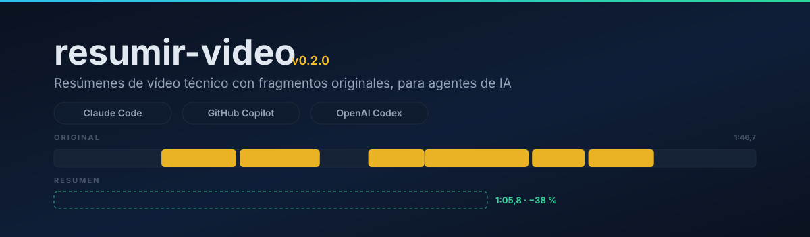

<p>
  <a href="CHANGELOG.md"></a>
  <a href="LICENSE"></a>
  <a href="https://github.com/captia-technology/RESUMEN-VIDEOS/actions/workflows/pruebas.yml"></a>
  
  
  
</p>

**Convierte una grabación técnica de una hora en un vídeo de minutos hecho con los fragmentos originales.**<br>
Sin narración sintética, con velocidad y pausas configurables, y con la evidencia de cada corte anotada.

[Instalación](#-instalación) · [Demostración](#-demostración-real) · [Garantías](#-garantías-verificadas) · [Cómo funciona](#-cómo-funciona) · [Documentación](docs/)

</div>

---

## Índice

- [Qué resuelve](#-qué-resuelve)
- [Instalación](#-instalación)
- [Demostración real](#-demostración-real)
- [Garantías verificadas](#-garantías-verificadas)
- [Cómo funciona](#-cómo-funciona)
- [Compatibilidad](#-compatibilidad)
- [Uso diario](#-uso-diario)
- [Qué incluye el repositorio](#-qué-incluye-el-repositorio)
- [Requisitos](#-requisitos)
- [Documentación](#-documentación)
- [Desarrollo](#-desarrollo)
- [Preguntas frecuentes](#-preguntas-frecuentes)
- [Hoja de ruta](#-hoja-de-ruta)

## 🎯 Qué resuelve

Una formación grabada, una reunión técnica o una demostración de dos horas contienen quince minutos de conocimiento. Un resumen de texto pierde lo que solo se ve —una tabla, un esquema que se construye, un procedimiento paso a paso— y un recorte automático por silencios destroza el contexto.

`resumir-video` es una **skill para agentes de IA**: el agente mira las imágenes y lee lo que se dice, decide qué unidades de conocimiento se conservan, y un asistente local con FFmpeg monta el resultado y lo valida.

<div align="center">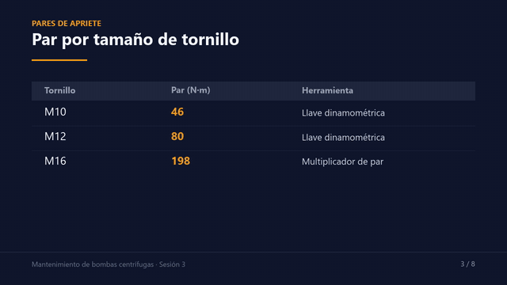</div>

| | |
| --- | --- |
| 🎬 **Fragmentos originales** | El resumen es vídeo y audio de la fuente, en su orden, a su resolución y a su velocidad. Sin música, sin voz sintética, sin rótulos. |
| 🧠 **Criterio audiovisual** | Conserva conceptos, normativa, requisitos, procedimientos, advertencias y **correcciones posteriores**, incluidas las demostraciones visuales sin narración. |
| 🔍 **Evidencia por corte** | Cada corte declara qué se oye y qué se ve; el informe relaciona tiempos de origen y de salida. |
| 🎯 **Objetivo configurable** | Pide un porcentaje o una duración; sin objetivo manda el criterio editorial. Por defecto acelera ×1,25 y elimina pausas, ambas configurables. |
| 📝 **Revisión previa** | `plan` publica una propuesta en lenguaje natural y espera tu aceptación (o `--directo`) antes de montar nada. |
| 🎙️ **Modo audio y documento** | Con solo audio no se monta vídeo: se entrega un documento en Markdown (y DOCX si hay conversor). En vídeo, el mismo documento acompaña siempre al MP4. |
| 🔒 **Todo en local** | Python de la biblioteca estándar y FFmpeg. El vídeo no se sube a ningún servicio; la transcripción opcional también es local. |
| 🧩 **Tres clientes, un paquete** | Claude Code, GitHub Copilot (CLI y VS Code) y OpenAI Codex, con el mismo `SKILL.md`. |

## ⚡ Instalación

Requisitos: **Python 3.10+**, **FFmpeg** con libx264 y AAC, y un agente capaz de ver imágenes. La [guía completa](docs/instalacion.md) cubre cada sistema operativo, las actualizaciones y los problemas habituales.

<table>
<tr><th>Claude Code</th><th>GitHub Copilot CLI</th><th>OpenAI Codex ≥ 0.131</th></tr>
<tr valign="top">
<td>

```text
claude plugin marketplace add \
  captia-technology/RESUMEN-VIDEOS
claude plugin install \
  resumir-video@resumen-videos
```

</td>
<td>

```text
copilot plugin marketplace add \
  captia-technology/RESUMEN-VIDEOS
copilot plugin install \
  resumir-video@resumen-videos
```

</td>
<td>

```text
codex plugin marketplace add \
  captia-technology/RESUMEN-VIDEOS
codex plugin add \
  resumir-video@resumen-videos
```

</td>
</tr>
</table>

En **VS Code**: paleta de comandos → **Chat: Install Plugin from Source** → `captia-technology/RESUMEN-VIDEOS`.

Sin sistema de plugins (Codex en el IDE u otros clientes compatibles con Agent Skills):

```text
git clone https://github.com/captia-technology/RESUMEN-VIDEOS.git
python3 RESUMEN-VIDEOS/scripts/install.py
```

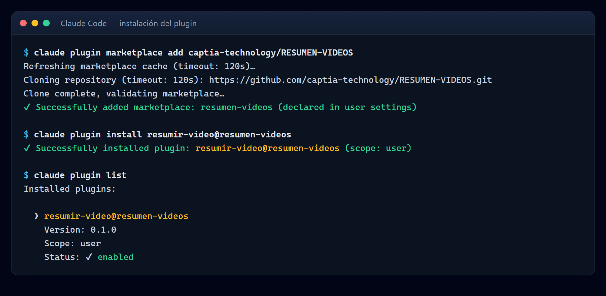

<details>
<summary><b>Las mismas órdenes en Copilot CLI y en Codex</b> (capturas reales)</summary>

<br>

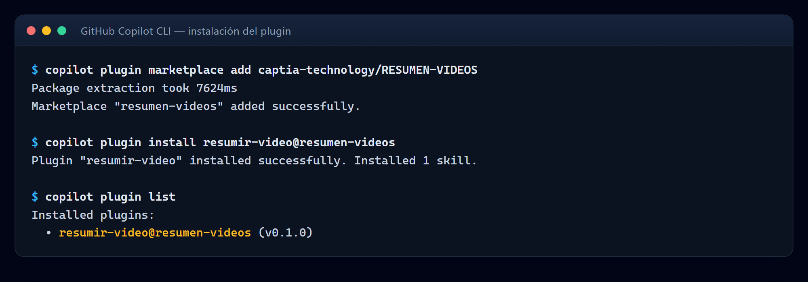

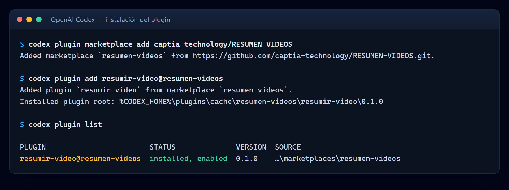

</details>

Después, en cualquier cliente:

```text
/resumir-video "grabaciones/formacion.mp4"                  # Claude Code y GitHub Copilot
$resumir-video:resumir-video "grabaciones/formacion.mp4"    # Codex
```

## 🎬 Demostración real

Ejecución completa de la skill sobre un **vídeo de formación sintético**, generado con FFmpeg y voz de síntesis; su contenido es ficticio. Este repositorio no contiene material de ningún cliente.

<div align="center">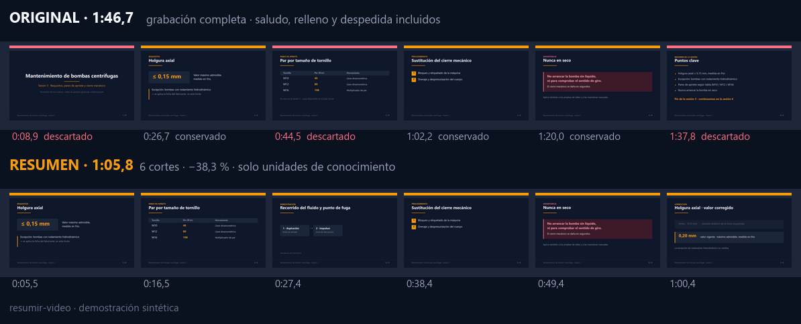</div>

**1:46,7 → 1:05,8 (−38,3 %) en 6 cortes.** La reducción no es un objetivo: es lo que queda al quitar el saludo, una espera sin contenido y la despedida.

<div align="center">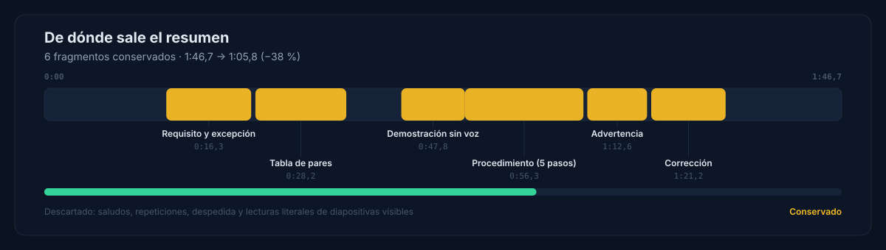</div>

Lo que demuestra el ejemplo, más allá del recorte:

- **Conserva una demostración visual de 8,5 s sin narración**, que un resumen basado solo en la transcripción descartaría.
- **Mantiene la corrección posterior** («0,20 mm, no 0,15 mm») junto al requisito que rectifica, y descarta la repetición final que aún citaba el valor superado.
- **Recorta dentro de una misma diapositiva**: en la unión 2 desaparecen 7,36 s de espera y con ellos la nota «ya vista en la sesión anterior».

<table>
<tr valign="top">
<td width="54%">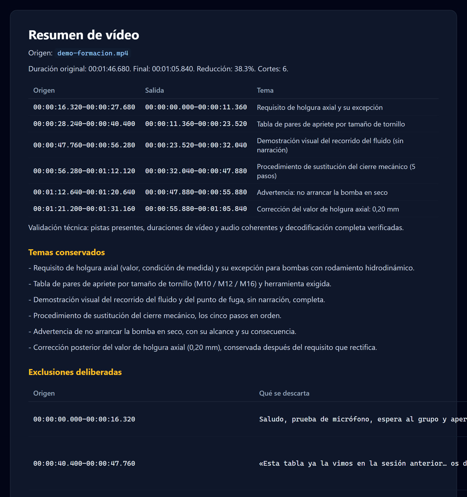</td>
<td>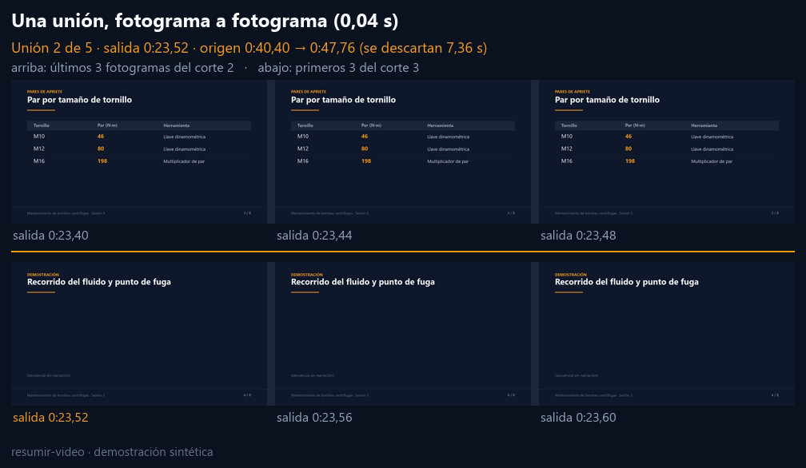</td>
</tr>
<tr>
<td align="center"><sub><code>montaje.md</code>: duraciones y tabla origen → salida; <code>resumen.md</code>: ideas clave conservadas y qué se excluyó.</sub></td>
<td align="center"><sub>Cada unión se revisa fotograma a fotograma: ni un fotograma ajeno, ni una frase partida.</sub></td>
</tr>
</table>

## ✅ Garantías verificadas

<table>
<tr valign="top">
<td width="52%">

- **Sin deriva de audio.** El audio de cada corte se extrae como PCM con la duración exacta de su vídeo y se codifica **una sola vez**: el desfase por unión no supera medio fotograma y no se acumula.
- **Cortes precisos.** Cada fragmento se recodifica a frecuencia constante desde el fotograma más próximo a su inicio; nunca se copia entre fotogramas clave.
- **Nada se sobrescribe.** Las carpetas de salida deben ser nuevas, el original no se toca y un plan solo monta el archivo exacto para el que se escribió.
- **Comprobación previa.** La falta de libx264, las fuentes HDR y los contenedores sin índice se detectan **antes** de empezar a montar.
- **Validación del resultado.** Duraciones de vídeo y audio, suma de cortes y decodificación completa: `resumen.mp4` solo aparece si pasa las tres.

</td>
<td>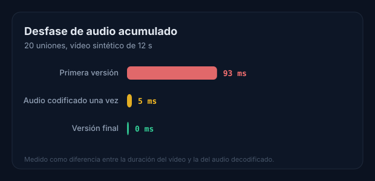</td>
</tr>
</table>

| Comprobación | Resultado |
| --- | --- |
| Instalación desde GitHub en Claude Code 2.1.274, Copilot CLI 1.0.85 y Codex 0.154.0 | Correcta, incluida la actualización de versión |
| 38 pruebas automáticas (23 de empaquetado e instalador, 15 de la skill) con Python 3.10 y 3.11 | Correctas, sin descargas ni material real |
| `claude plugin validate --strict` (plugin y catálogo) y los validadores de Codex | Correctos |
| Uso de extremo a extremo siguiendo las instrucciones, con revisión de uniones | Sin órdenes fallidas |
| Revisión adversarial del montaje a 25, 29,97 y 5 fps, con frecuencia variable y MPEG-TS | Tres fallos encontrados y corregidos |

Versiones, órdenes y lo que queda pendiente de evidencia: [plan de validación](docs/plan.md#validación-2026-09-17).

## 🧠 Cómo funciona

<div align="center">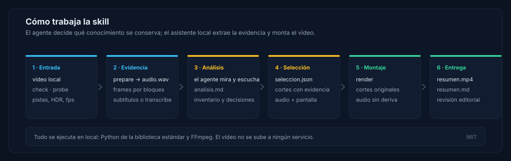</div>

El reparto es deliberado: **el agente juzga, el asistente ejecuta**. `video.py` nunca decide qué conocimiento importa —no infiere valor del silencio ni de palabras clave— y el agente no manipula el vídeo fuera de él.

| El agente | El asistente `video.py` |
| --- | --- |
| Elige la pista de voz, los bloques y la densidad de muestreo | `check`, `probe`: entorno, pistas, HDR, fotogramas |
| Lee subtítulos o revisa la transcripción y su sincronía | `prepare`: carpeta de trabajo y audio de análisis |
| Mira los fotogramas y cruza voz y pantalla en `analisis.md` | `frames`: el fotograma en pantalla en cada instante |
| Selecciona las unidades de conocimiento y redacta su evidencia | `transcribe`: opcional, local, en CPU o GPU |
| Revisa uniones, sincronía, legibilidad y cobertura | `render`: monta, valida y documenta |

## 🧩 Compatibilidad

| Cliente | Plugin | Skill independiente | Invocación |
| --- | --- | --- | --- |
| Claude Code | ✅ | `~/.claude/skills`, `.claude/skills` | `/resumir-video` |
| GitHub Copilot CLI | ✅ | `~/.copilot/skills`, `~/.agents/skills`, `.github/skills` | `/resumir-video` |
| VS Code + Copilot Chat (1.133+) | ✅ | Las mismas y `~/.claude/skills` | `/resumir-video` |
| OpenAI Codex CLI ≥ 0.131 y app | ✅ | `~/.agents/skills`, `.agents/skills` | `$resumir-video:resumir-video` |
| Codex en el IDE | — | `~/.agents/skills`, `.agents/skills` | `$resumir-video` |
| Otros clientes con [Agent Skills](https://agentskills.io/specification) | Según el cliente | Carpeta de skills del cliente | Según el cliente |

`SKILL.md` usa solo los campos portables del estándar (`name`, `description`, `license`, `metadata`); la interfaz propia de Codex vive en archivos que los demás clientes ignoran.

## 🛠 Uso diario

Basta con pedirlo en lenguaje natural («resume este vídeo: `grabaciones/sesion.mp4`, en unos 10 minutos») o invocar la skill con la ruta. El agente comprueba el entorno, extrae la evidencia, analiza, selecciona los cortes con su justificación, monta y entrega.

En una carpeta de trabajo nueva (por defecto `resumenes/<nombre>/`, excluida de Git):

| Archivo | Qué contiene |
| --- | --- |
| `vN/resumen.mp4` | El montaje con los fragmentos originales |
| `vN/seleccion.json` | El plan de cortes, con motivo y evidencia de audio y pantalla |
| `vN/montaje.md` | Versión, cortes, velocidad, cadencia, duración de salida, desfase vídeo-audio y tabla origen → salida con la distancia de imagen y envolvente de cada corte |
| `vN/resumen.md` | Ficha, resumen editorial, ideas clave con su tiempo, preguntas y respuestas y qué se ha dejado fuera |
| `analisis.md` | Inventario del agente: qué se vio, qué se oyó y qué se decidió |

<details>
<summary><b>Un corte del plan, con su evidencia</b></summary>

```json
{
  "start": 16.32,
  "end": 27.68,
  "title": "Requisito de holgura axial y su excepción",
  "reason": "Conserva el valor, la condición de medida y la excepción que lo modifica.",
  "audio_evidence": "16,3–27,7: enuncia el límite y su excepción; contrastado con los subtítulos.",
  "visual_evidence": "18 y 24 s: diapositiva con el valor y su nota de excepción, revisada a resolución original."
}
```

El asistente valida la estructura y los tiempos; la veracidad de la evidencia es responsabilidad del agente, y por eso queda escrita.

</details>

## 📦 Qué incluye el repositorio

```text
.claude-plugin/marketplace.json   Catálogo para Claude Code y GitHub Copilot
.agents/plugins/marketplace.json  Catálogo nativo de Codex
plugins/resumir-video/            Plugin distribuible (única copia de la skill)
├── plugin.json                   Manifiesto Agent Plugins 1.0
├── .claude-plugin/plugin.json    Manifiesto de Claude Code
├── .codex-plugin/plugin.json     Manifiesto e interfaz de Codex
└── skills/resumir-video/         SKILL.md y scripts
    ├── scripts/                  common.py, video.py, plan.py, render.py y doc.py
    └── references/               operacion.md, compresion.md, revision.md y documento.md
scripts/install.py                Instalación como skill independiente
scripts/generar_graficos.py       Gráficos del README a partir de datos medidos
tests/test_packaging.py           Manifiestos, skill e instalador
.github/workflows/pruebas.yml     Integración continua (Ubuntu y Windows)
docs/                             Documentación del proyecto
```

## 📋 Requisitos

| Requisito | Windows | macOS | Linux (Debian/Ubuntu) |
| --- | --- | --- | --- |
| Python 3.10+ | `winget install Python.Python.3.12` | `brew install python` | `sudo apt install python3 python3-venv` |
| FFmpeg con libx264 y AAC | `winget install Gyan.FFmpeg` | `brew install ffmpeg` | `sudo apt install ffmpeg` |

Comprueba el entorno con `python3 plugins/resumir-video/skills/resumir-video/scripts/video.py check`: imprime un JSON que termina en `"ok": true`. La transcripción local con `faster-whisper` es **opcional**: si el vídeo trae subtítulos fiables, no hace falta.

## 📚 Documentación

| Documento | Fuente de verdad para |
| --- | --- |
| [Capacidades](docs/capacidades.md) | Qué hace y qué no, entradas, salidas, garantías, rendimiento, privacidad y límites |
| [Instalación](docs/instalacion.md) | Instalación, actualización y publicación por cliente |
| [Referencia de operación](plugins/resumir-video/skills/resumir-video/references/operacion.md) | Órdenes de `video.py`, formato del plan y procedimientos de revisión |
| [Arquitectura](docs/arquitectura.md) · [Decisiones](docs/decisiones.md) | Qué se distribuye, qué lee cada cliente y por qué |
| [Requisitos](docs/requisitos.md) · [Plan](docs/plan.md) | Alcance, criterios de aceptación y verificación |
| [Contribuir](CONTRIBUTING.md) · [Seguridad](SECURITY.md) · [Cambios](CHANGELOG.md) | Trabajar en el repositorio |

## 🧪 Desarrollo

```text
python3 -B -m unittest discover -s tests                                      # pruebas de empaquetado e instalador
python3 -B -m unittest discover -s plugins/resumir-video/skills/resumir-video/scripts -p "test_*.py"
claude plugin validate plugins/resumir-video --strict && claude plugin validate . --strict
python3 -B scripts/generar_graficos.py                                        # regenera los gráficos
```

Las pruebas de la skill generan su propio vídeo sintético: no descargan nada y no tocan material real. La integración continua las ejecuta en Ubuntu y Windows con Python 3.10 y 3.12. Antes de proponer un cambio, lee [AGENTS.md](AGENTS.md) y [CONTRIBUTING.md](CONTRIBUTING.md).

## ❓ Preguntas frecuentes

<details>
<summary><b>¿Puede acelerar la voz o quitar pausas para comprimir más?</b></summary>

Sí, y desde la 0.2.0 lo hace **por defecto**: aplica velocidad ×1,25 y elimina pausas para acercarse al objetivo de compresión que pidas (o al criterio editorial, si no pides ninguno). Para desactivarlo, indica `velocidad=1` y `pausas=no` al invocar la skill. Detalle en [D-007](docs/decisiones.md#d-007--compresión-por-defecto-con-objetivo-configurable).
</details>

<details>
<summary><b>¿Necesito transcribir el vídeo?</b></summary>

Solo si no hay subtítulos fiables. La skill los reutiliza cuando existen y comprueba su sincronía con detección de silencios. Si hay que transcribir, `faster-whisper` funciona en CPU y no requiere ninguna API de pago; los pesos solo se descargan con `--allow-download`.
</details>

<details>
<summary><b>¿Qué pasa con el material confidencial?</b></summary>

El vídeo no sale de tu máquina, pero el agente sí recibe los fotogramas y la transcripción que inspecciona: su tratamiento depende del proveedor del agente. Las carpetas de trabajo se crean con su propio `.gitignore` y el informe no incluye la ruta completa del origen. Detalle en [SECURITY.md](SECURITY.md).
</details>

<details>
<summary><b>¿Cuánto tarda y cuánto espacio necesita?</b></summary>

El análisis domina el tiempo; el montaje recodifica solo los fragmentos elegidos. En grabaciones 4K con fotogramas clave muy espaciados, cada imagen de análisis puede tardar decenas de segundos: conviene muestrear por bloques. Reserva unos 115 MB por hora de audio de análisis y unas tres veces el tamaño previsto del resumen.
</details>

<details>
<summary><b>¿Funciona con cualquier formato?</b></summary>

Con cualquier archivo que FFmpeg lea y tenga una sola pista de vídeo. Se rechazan las fuentes HDR y las de varias pistas de vídeo; las de 10 bits o 4:4:4 se convierten a 8 bits y los contenedores sin índice (MPEG-TS) se avisan antes de montar. Ver [entradas admitidas](docs/capacidades.md#entradas).
</details>

<details>
<summary><b>¿Puedo usarla sin instalar el plugin?</b></summary>

Sí: `python3 scripts/install.py` copia la skill en las carpetas de skills de cada cliente, con `--status`, `--force` y `--uninstall`. Es la vía para Codex en el IDE y para cualquier cliente compatible con Agent Skills.
</details>

## 🗺 Hoja de ruta

Los cuatro puntos que figuraban aquí —barrido con detección de cambios, transcripción y montaje reanudables, aceleración/eliminación de pausas y reasignación de planes— ya los entrega la 0.2.0 ([CHANGELOG](CHANGELOG.md)). No hay ampliaciones pendientes de decisión; las prioridades abiertas están en [requisitos.md](docs/requisitos.md#pendiente).

---

<div align="center">

**Versión 0.2.0 · Licencia [MIT](LICENSE) · © 2026 CAPTIA TECHNOLOGY S.L.**

Las figuras se generan con [`scripts/generar_graficos.py`](scripts/generar_graficos.py) a partir de [datos medidos](docs/img/datos.json); las capturas son salidas reales de los clientes.

</div>
