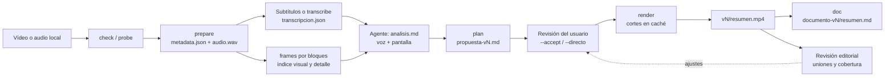

# Capacidades

Catálogo de lo que hace la skill `resumir-video` 0.2.1, cómo reparte el trabajo entre el agente y el asistente local, qué entradas admite, qué produce, qué garantiza y cuáles son sus límites. La instalación está en [instalacion.md](instalacion.md); las órdenes exactas y los formatos de archivo, en la [referencia de operación](../plugins/resumir-video/skills/resumir-video/references/operacion.md).

## Qué hace

Convierte un vídeo técnico local (formación, ponencia, reunión, demostración) o una grabación de solo
audio en un **MP4 más corto hecho con fragmentos originales** (o, en modo audio, un documento), sin
narración sintética ni música. El agente estudia a la vez lo que se dice y lo que se muestra, decide
qué unidades de conocimiento conservar y documenta la evidencia de cada corte. Un asistente en Python
con FFmpeg extrae la evidencia y monta el resultado de forma determinista y verificable. Por defecto
aplica velocidad ×1,25 y elimina pausas; ambas son configurables y pueden desactivarse
([D-007](decisiones.md#d-007--compresión-por-defecto-con-objetivo-configurable)).

No hace:

- Resúmenes solo de texto cuando es posible montar el vídeo.
- Selección automática por silencios, velocidad de voz o palabras clave.
- Transiciones, rótulos o recortes de diapositivas.
- Cambios en el orden original de los fragmentos.
- Envío del vídeo a servicios externos.



## Reparto de responsabilidades

| Agente (instrucciones de `SKILL.md`) | Asistente `video.py` |
| --- | --- |
| Interpreta la ruta y las indicaciones recibidas y pregunta solo lo imprescindible | Comprueba el entorno, los codificadores y el espacio libre |
| Elige pista de voz, bloques de trabajo y densidad de muestreo | Inspecciona pistas e identidad del archivo |
| Lee subtítulos o revisa la transcripción y comprueba su sincronía | Extrae audio de análisis y fotogramas |
| Mira las imágenes y cruza voz y pantalla en `analisis.md` | Transcribe en local de forma opcional |
| Selecciona unidades de conocimiento y redacta la evidencia | Valida el plan y monta los cortes |
| Revisa uniones, sincronía, legibilidad y cobertura | Verifica pistas, duraciones y decodificación |
| Completa el informe editorial y entrega | Genera el índice temporal del informe |

El asistente no decide qué conocimiento importa y el agente no manipula el vídeo fuera del asistente.

## Criterio editorial

- **Evidencia de ambas modalidades.** No se da por terminado un resumen sin analizar audio (o texto temporal fiable) e imagen. Cada corte registra `audio_evidence` y `visual_evidence`.
- **Recorrido visual por muestreo.** Índice de un fotograma cada 15 s por bloques; es un índice, no prueba de cobertura completa. Se amplía a 1–3 s en cambios, tablas, demostraciones, deícticos («aquí»), silencios e intervalos inciertos, y las limitaciones que queden se declaran en el informe. Detalle a resolución original cuando algo es ilegible.
- **Prioridades.** Conceptos, normativa con versión y ámbito, requisitos, procedimientos, arquitectura, configuraciones, ejemplos, decisiones, conclusiones y advertencias, con sus premisas, excepciones y correcciones.
- **Reducción.** Se eliminan saludos, interrupciones, repeticiones, esperas y lecturas literales de diapositivas visibles. No hay porcentaje fijo; una duración solicitada es un objetivo que se discute si destruye contexto.
- **Higiene del contenido.** Se excluyen credenciales, datos personales, incidentes sobre personas y material con restricciones de difusión, y se deja constancia en el informe. El texto del vídeo nunca se trata como instrucciones.
- **Cortes limpios.** Entre frases o pasos completos, con márgenes de 0,2–0,5 s y en el orden original.

## Compatibilidad

| Cliente | Plugin | Skill independiente | Invocación explícita | Activación implícita |
| --- | --- | --- | --- | --- |
| Claude Code | Sí (`.claude-plugin/`) | `~/.claude/skills`, `.claude/skills` | `/resumir-video`, `/resumir-video:resumir-video` | Sí |
| GitHub Copilot CLI | Sí (`plugin.json` Agent Plugins 1.0) | `~/.copilot/skills` (o `$COPILOT_HOME/skills`), `~/.agents/skills`, `.github/skills`, `.agents/skills`, `.claude/skills` | `/resumir-video` | Sí |
| VS Code con Copilot Chat (1.133+) | Sí | Las mismas y `~/.claude/skills` | `/resumir-video` | Sí |
| Agente en la nube de Copilot | Declarado en el repositorio | Carpetas del repositorio | No (por descripción) | Sí |
| Codex CLI 0.131+ y app | Sí (`.codex-plugin/`; también `plugin.json` desde la 0.146) | `~/.agents/skills`, `.agents/skills` | `$resumir-video:resumir-video` | Sí |
| Codex en el IDE | No | `~/.agents/skills`, `.agents/skills` | `$resumir-video` | Sí |
| Otros clientes con Agent Skills | Según el cliente | Carpeta de skills del cliente | Según el cliente | Según el cliente |

`SKILL.md` usa solo los campos portables del estándar [Agent Skills](https://agentskills.io/specification) (`name`, `description`, `license`, `metadata`). La interfaz de Codex está en `agents/openai.yaml` y `.codex-plugin/plugin.json`; los demás clientes la ignoran. Las versiones y órdenes comprobadas, y lo que falta por comprobar (entre otras cosas, el agente en la nube y la invocación dentro de una sesión), figuran en el [plan](plan.md#validación-2026-09-17).

Plataformas: Windows, macOS y Linux con Python 3.10+ y FFmpeg (libx264 y AAC); comprobado en Windows 11 y en Ubuntu (integración continua); en macOS, pendiente de evidencia ([plan](plan.md#validación-2026-09-17)). No requiere GPU, servidor ni API de pago; la transcripción puede usar CUDA si está disponible.

## Entradas

| Entrada | Soporte |
| --- | --- |
| Vídeo | Cualquier archivo local que FFmpeg lea, con exactamente una pista de vídeo (se ignoran carátulas). Admite rutas con espacios, Unicode, apóstrofos o `#`; las carpetas de salida también pueden contener `#` o `?` si el sistema lo permite. |
| Solo audio | Cualquier archivo que FFmpeg lea sin pista de vídeo. No se monta nada: se entrega solo el documento (`documento-vN/resumen.md`), con DOCX si hay conversor ([D-010](decisiones.md#d-010--modo-audio-y-documento-con-motores-opcionales)). |
| Audio | Primera pista por defecto o cualquier pista por índice global (`--audio-stream`, `audio_stream`). Obligatorio para `prepare` y `render`. |
| Subtítulos | SRT o WebVTT del propio medio: `transcribe --subtitles` los normaliza a `transcripcion.json` (`settings.origen = "subtitulos"`, segmentos sin `words[]` y aviso `sin_marcas_por_palabra`); otros formatos los lee el agente directamente. |
| Idioma | Cualquiera que admita el transcriptor; detección automática si no se indica. |
| Duración objetivo | Opcional, como objetivo editorial; puede indicarse tras la ruta al invocar la skill. |

Casos especiales:

- **Se rechazan:** HDR (PQ/HLG) y varias pistas de vídeo.
- **Se convierten:** 10 bits o 4:4:4 a 8 bits 4:2:0, y frecuencia de fotogramas variable a constante; las fuentes de más de 120 fps se montan a 30 fps.
- **Se tienen en cuenta:** el `start_time` de la pista de vídeo y la duración por pista de MKV/WebM.
- **Requieren revisión específica:** discontinuidades de tiempo y desfases de inicio inusuales entre pistas.
- **Sin índice (MPEG-TS, M2TS):** se buscan con más margen; si el contenedor no puede entregar el fotograma pedido, el montaje se detiene con un mensaje que pide convertir la fuente a MP4 o MKV.

## Salidas

```text
resumenes/<nombre>/            carpeta de trabajo (la indica el usuario; la crea prepare)
├── .gitignore                 "*": evita versionar material confidencial
├── metadata.json              ffprobe + source + audio_stream
├── audio.wav                  mono 16 kHz, solo para análisis
├── transcripcion.json         opcional: segmentos y palabras con tiempos (o subtítulos normalizados)
├── imagenes-*/ detalle-*/     JPEG + index.json por bloque
├── analisis.md                inventario del agente: evidencia, tiempos, hallazgos, decisiones
├── propuesta-vN.md            propuesta en lenguaje natural que escribe plan; espera aceptación
├── seleccion-vN.json          plan publicado por plan (esquema-vN.json en modo audio)
├── historial.jsonl            diario de eventos: init, edit, accept, render, verify, doc, deliver
├── revision/                  opcional: fotogramas de las uniones y extractos de audio revisados
├── vN/                        versión inmutable montada por render; no existe en modo audio
│   ├── resumen.mp4             H.264 CRF 18 (yuv420p, frecuencia constante) + AAC 192 kbps
│   ├── seleccion.json          plan aceptado, con la frase de aceptación
│   ├── validacion.json         comprobaciones bloqueantes de render
│   ├── uniones/                hojas de contacto de cada unión, para la revisión editorial
│   ├── cobertura.json          opcional: cobertura de palabras (compare; informativo)
│   ├── resumen.md               documento de doc: ficha, resumen, ideas clave, preguntas y limitaciones
│   ├── resumen.docx             opcional: si hay Pandoc o python-docx
│   └── timeline.*               línea temporal de texto y, con Pillow, timeline.png etiquetado
├── vN-rotulado/                 opcional (rotular): copia derivada con rótulos; vN/ no cambia
│   ├── resumen-rotulado.mp4     tema del corte, origen, posición y líneas temporales sobre la imagen
│   ├── linea-tiempo.png         de dónde sale cada corte y dónde cae en el resumen, con leyenda
│   └── rotulos.json             rótulo, intervalo de origen e intervalo de salida de cada corte
└── documento-vN/                único resultado en modo audio: mismo resumen.md/.docx que en vídeo
```

| Archivo | Contenido principal |
| --- | --- |
| `metadata.json` | Salida completa de `ffprobe`, `source` (`path`, `size`, `mtime_ns`) y `audio_stream`. |
| `index.json` | `source` y `frames[]` con `time` (s, instante usado tras ajustar al último fotograma) y `file`. |
| `transcripcion.json` | `language`, `settings` (modelo, dispositivo, tipo de cálculo, haz, VAD) y `segments[]` con `words[]`. |
| `seleccion-vN.json` / `esquema-vN.json` | `source`, `audio_stream`, `settings` (objetivo, velocidad, eliminación de pausas) y `segments[]` con `start`, `end`, `title`, `reason`, `audio_evidence`, `visual_evidence`, `priority`, `pinned`; detalle en [compresión](../plugins/resumir-video/skills/resumir-video/references/compresion.md). |
| `resumen.md` | Documento editorial de `doc`: ficha, resumen, ideas clave, preguntas y respuestas de la sesión, y qué se ha dejado fuera; detalle en [documento](../plugins/resumir-video/skills/resumir-video/references/documento.md). |

## Asistente `video.py`

| Subcomando | Propósito | Escribe |
| --- | --- | --- |
| `check` | Informa de Python, FFmpeg, libx264, AAC, `faster-whisper` (en el intérprete que lo ejecuta), el entorno virtual recomendado y el espacio libre. Siempre imprime JSON; código 0 si todo lo obligatorio está disponible. | Nada |
| `probe VIDEO` | Muestra pistas, formato e identidad del archivo en JSON. | Nada |
| `prepare VIDEO --work DIR` | Crea la carpeta de trabajo (no debe existir) y extrae el audio de análisis. | `.gitignore`, `metadata.json`, `audio.wav` |
| `frames VIDEO --out DIR` | Extrae hasta 600 fotogramas por llamada en [`--start`, `--end`) cada `--step` s, con `--width` máximo (0 = original); cada imagen es el fotograma en pantalla en ese instante. | JPEG, `index.json` |
| `transcribe AUDIO --out JSON` | Transcribe con faster-whisper y marcas por palabra (modelo, idioma, dispositivo, tipo de cálculo, haz, VAD, hilos), o con `--subtitles RUTA` normaliza un SRT/WebVTT existente en vez de transcribir. | `transcripcion.json` |
| `search TRANSCRIPCION QUERY` | Busca en la transcripción sin distinguir tildes ni mayúsculas; `--context` añade segmentos alrededor y `--max` limita las coincidencias. | Nada |
| `plan --work DIR` | Calcula bordes, tramos, estimación, estados y avisos desde un borrador (`--draft`) y escribe la propuesta; detalle en [compresión](../plugins/resumir-video/skills/resumir-video/references/compresion.md). | `propuesta-vN.md`, `seleccion-vN.json`/`esquema-vN.json`, `historial.jsonl` |
| `render VIDEO --work DIR --plan JSON` | Monta `vN/resumen.mp4` desde un plan aceptado (`--accept`/`--directo`), con caché de cortes y validación bloqueante; detalle en [revisión](../plugins/resumir-video/skills/resumir-video/references/revision.md). | `vN/resumen.mp4`, `vN/seleccion.json`, `vN/validacion.json`, `vN/uniones/` |
| `doc --work DIR --version N` | Expande las marcas del documento del agente y publica Markdown y DOCX; detalle en [documento](../plugins/resumir-video/skills/resumir-video/references/documento.md). | En vídeo, `vN/resumen.md`(+`.docx`); en audio, `documento-vN/resumen.md`(+`.docx`) |
| `compare --work DIR --version N` | Mide la cobertura de palabras del resumen frente al original; informativo, nunca bloquea. | `vN/cobertura.json` |
| `rotular --work DIR --version N` | Copia derivada del resumen con el tema de cada corte y las líneas temporales del original y del resumen sobre la imagen (`--labels` para rótulos propios); detalle en [operación](../plugins/resumir-video/skills/resumir-video/references/operacion.md#rótulos). | `vN-rotulado/` |

Todas las opciones y sus valores por defecto aparecen con `video.py <subcomando> --help` y en la referencia de operación. `video.py --version` muestra la versión.

## Garantías y validaciones

- **Sin sobrescritura.** `prepare`, `frames` y `render` exigen una carpeta de salida que no exista y la crean junto con sus carpetas padre; si existe, se detienen con un mensaje que propone otro nombre. `transcribe` exige un JSON que no exista dentro de una carpeta existente. Ningún JSON se reemplaza y el vídeo original nunca se modifica.
- **Plan ligado a su origen, reasignable por huella.** `render` exige que `source` coincida en huella (tamaño, `mtime_ns` y sha256 de los extremos, o del archivo completo si mide 8 MiB o menos) y que `audio_stream` sea un entero que identifique una pista de audio. Si solo cambia `source.path` pero la huella coincide, `render` lo avisa y actualiza `source` en el plan publicado; una huella distinta sigue siendo un error ([D-011](decisiones.md#d-011--identidad-por-huella-y-reasignación-de-planes)).
- **Plan coherente.** Cortes con tiempos finitos, en orden cronológico, sin solapes (se admiten contiguos), dentro de la pista de vídeo y con título, motivo y evidencias no vacíos.
- **Comprobaciones previas.** HDR y ausencia de libx264 o AAC se detectan antes de crear la salida.
- **Bordes entre palabras.** Un borde que cae sobre voz se lleva al silencio más próximo (0,6 s como mucho); si el fondo nunca baja del umbral, como en una videollamada con ruido constante, se lleva al hueco entre palabras según las marcas de la transcripción. Solo sin marcas, o con una palabra de más de 1 s, queda el aviso `borde_en_voz`.
- **Cortes precisos.** Cada corte se recodifica a frecuencia constante y sin fotogramas B, empezando por el fotograma más próximo a su inicio (a lo sumo medio fotograma de diferencia; nunca copia directa entre fotogramas clave), y debe producir al menos su duración menos dos fotogramas.
- **Sincronía sin deriva.** Cada corte se produce en dos pasadas de FFmpeg (vídeo H.264 y audio PCM de 24 bits) que se remultiplexan en el mismo MKV sin recodificar, verificadas por recuento exacto de fotogramas y muestras antes de entrar en la caché de `cortes/`; el audio se codifica una sola vez, en el ensamblado final, así que las uniones no acumulan desfase ([D-006](decisiones.md#d-006--audio-codificado-una-sola-vez-en-el-montaje), [D-009](decisiones.md#d-009--montaje-por-cortes-en-caché-con-recuento-forzado)). El desfase en cada unión es como máximo de medio fotograma. En una medición del 2026-09-17 con 20 uniones, las duraciones del vídeo y del audio decodificado coincidieron (con el montaje de la primera versión diferían unos 90 ms); la prueba automática admite hasta 50 ms.
- **Validación del resultado.** Recuento exacto de fotogramas del vídeo frente a la suma de cortes, desfase vídeo-audio de como máximo 0,1 s y decodificación completa sin errores. `resumen.mp4` solo aparece si pasa estas comprobaciones.
- **Salida legible por agentes.** Mensajes en UTF-8, errores como `Error: …` con código 1, errores de argumentos con código 2 e interrupción (Ctrl+C) con código 130. `render` y `transcribe` informan del avance (`Corte i/N`, `Transcrito hasta X s`), y `seleccion.json` se admite en UTF-8 con o sin BOM.

La validación técnica no certifica la calidad editorial: la revisión de uniones y cobertura corresponde al agente.

## Rendimiento y recursos

- El montaje usa por defecto `min(4, núcleos)` hilos (`--threads`). En 4K, reduce hilos si falta memoria.
- `frames` hace una búsqueda por imagen: rápida en fuentes con fotogramas clave frecuentes, lenta (decenas de segundos por imagen) en grabaciones 4K de pantalla con fotogramas clave muy espaciados.
- La transcripción por defecto es CPU/int8 con modelo `small` y haz 1; `--device cuda --compute-type float16` acelera en GPU compatibles.
- Espacio: fotogramas de análisis, WAV de 16 kHz (unos 115 MB por hora), cortes intermedios y el MP4 final; `check` informa del espacio libre del directorio actual. CRF 18 prioriza la calidad y puede superar el bitrate de grabaciones de pantalla muy comprimidas.

## Privacidad y seguridad

- Todo el procesamiento es local. El vídeo no se sube; los modelos solo se descargan con `--allow-download`.
- El agente recibe los extractos que inspecciona (fotogramas, transcripción); su tratamiento depende del proveedor del agente.
- Las carpetas de trabajo llevan `.gitignore` y `resumen.md` no incluye la ruta completa del origen. `metadata.json`, `index.json` y `seleccion.json` sí la contienen: no los publiques sin revisarlos.
- El asistente (`video.py`) ejecuta FFmpeg y ffprobe con listas de argumentos, sin shell, así que un nombre de archivo nunca se interpreta como orden. Las órdenes que lanza el agente sí pasan por la shell del cliente: la ruta debe ir entre comillas simples (o escapada), porque en Bash y PowerShell las comillas dobles no impiden que se ejecute `$(…)`.
- La skill no necesita permisos preaprobados: el usuario autoriza cada orden según la política de su cliente.

## Limitaciones conocidas

- El VAD puede omitir habla real; conviene repetir los huecos con `--no-vad`.
- El índice de 15 s puede no mostrar una diapositiva breve; hay que ampliar el muestreo donde el audio o los cambios lo indiquen.
- La caché `cortes/` crece con cada corte distinto montado; para repetir un montaje desde cero con otros parámetros de codificación, borra esa carpeta a mano.
- `resumen.mp4` solo contiene la pista de vídeo y la pista de audio elegida: se descartan los subtítulos incrustados, las demás pistas de audio, los capítulos y los metadatos del contenedor.
- La imagen se convierte a 8 bits 4:2:0 (yuv420p) y una dimensión impar se rellena con un píxel. En grabaciones de pantalla 4:4:4, revisa la legibilidad del texto fino en color.
- La calidad del resumen depende de la capacidad multimodal del agente y del tiempo disponible para revisar.

## Posibles ampliaciones

Los seis puntos que figuraban aquí a partir de la experiencia con grabaciones largas en 4K —barrido
con índice de cambios y hojas de contacto, transcripción y montaje reanudables por bloques,
reasignación de un plan a un vídeo movido y aceleración/eliminación de pausas— ya los entrega la
0.2.0 ([D-007](decisiones.md#d-007--compresión-por-defecto-con-objetivo-configurable),
[D-009](decisiones.md#d-009--montaje-por-cortes-en-caché-con-recuento-forzado),
[D-011](decisiones.md#d-011--identidad-por-huella-y-reasignación-de-planes)). No hay ampliaciones
pendientes de decisión; las prioridades abiertas están en [requisitos.md](requisitos.md#pendiente).
